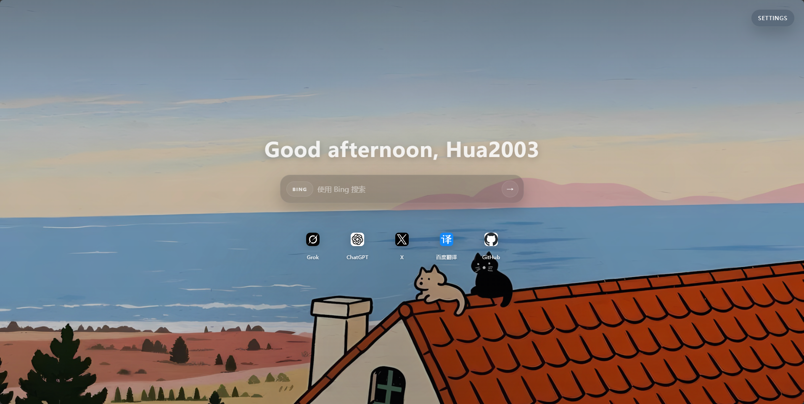
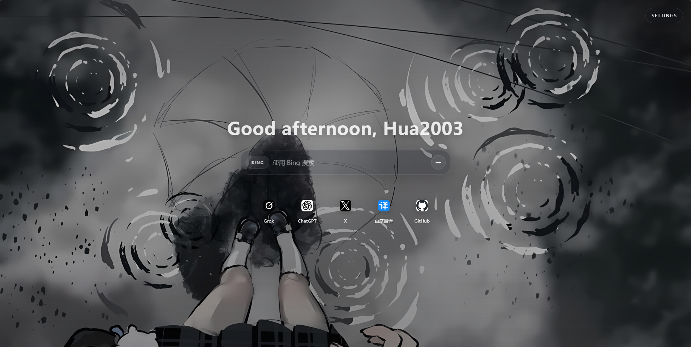

# 🌴 Simple Tab

> A lightweight, beautiful Chrome new tab extension with wallpapers, search, and bookmarks.

[English](#english) · [中文](#中文)

---

## English

### Features

- 🖼️ **35 Built-in Wallpapers** — Anime, landscapes, dark themes, curated aesthetics
- 🔍 **Multi-Engine Search** — Switch between Bing, Google, and Baidu
- ⭐ **Bookmark Bar** — Quick access to your favorite sites
- 🌅 **Time-Based Themes** — Auto adapts UI colors by time of day (morning / noon / afternoon / night)
- ⚙️ **Customizable** — Your name greeting, search engine preference
- 🚀 **Lightweight** — Pure vanilla JS, no frameworks, fast load

### Screenshots




### Installation

1. Download or clone this repository
2. Open `chrome://extensions/`
3. Enable **Developer mode** (top right toggle)
4. Click **Load unpacked**
5. Select the `D:\Tab` folder
6. Open a new tab — enjoy! 🎉

### How to Add/Change Wallpapers

```bash
# Place your images in the wallpapers/ folder
# Supported formats: PNG, JPG, WEBP

# Sync wallpapers to the extension
npm run sync:wallpapers

# Or watch for changes automatically
npm run watch:wallpapers
```

### Development

```bash
# Install dependencies
npm install

# Sync wallpaper changes
npm run sync:wallpapers

# Watch wallpaper changes
npm run watch:wallpapers
```

### Project Structure

```
js/
├── app.js           # Bootstrap, dependency injection
├── config/
│   └── constants.js # Wallpapers, bookmarks, search engines
├── features/        # Feature init functions
├── lib/             # Storage, navigation utilities
└── ui/              # DOM getters, render functions
```

### License

MIT © 2026 hua2003-liu

---

## 中文

### 功能特点

- 🖼️ **35 张精选壁纸** — 动漫、风景、暗色系、唯美画风
- 🔍 **多搜索引擎** — 切换 Bing、Google、百度
- ⭐ **书签导航** — 快速访问常用网站
- 🌅 **时间主题** — 根据时间段自动变换界面色调
- ⚙️ **个性化设置** — 定制欢迎语、搜索引擎
- 🚀 **轻量快速** — 原生 JavaScript，无依赖

### 安装方式

1. 下载或克隆本仓库
2. 打开 `chrome://extensions/`
3. 开启右上角 **开发者模式**
4. 点击 **加载已解压的扩展程序**
5. 选择 `D:\Tab` 文件夹
6. 打开新标签页 — 搞定！🎉

### 更换壁纸

```bash
# 把图片放入 wallpapers/ 文件夹
# 支持格式：PNG、JPG、WEBP

# 同步壁纸到扩展
npm run sync:wallpapers

# 监听变化自动同步
npm run watch:wallpapers
```

### 开发

```bash
# 安装依赖
npm install

# 同步壁纸
npm run sync:wallpapers

# 监听壁纸变化
npm run watch:wallpapers
```

### 项目结构

```
js/
├── app.js           # 启动器，依赖注入
├── config/
│   └── constants.js # 壁纸、书签、搜索引擎配置
├── features/        # 各功能初始化函数
├── lib/             # 存储、导航工具
└── ui/              # DOM 获取器、渲染函数
```

### 开源协议

MIT © 2026 hua2003-liu
